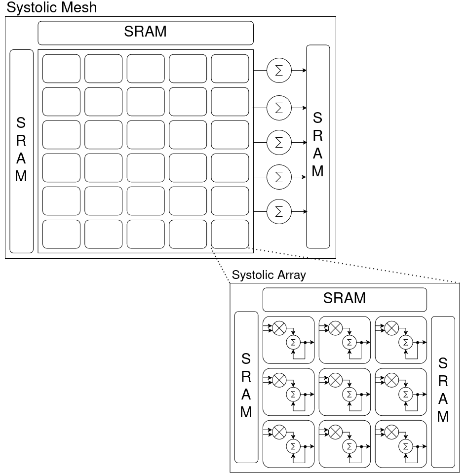

# SystolicMesh

A parameterised, tile-scalable systolic-array matrix-multiplication engine in SystemVerilog, computing **C = A × B** over IEEE-754 Float32.

**Dependencies:** Verilator · Python ≥ 3.10 · NumPy

---

## Architecture



### Systolic Mesh

The top-level module is a 2-D grid of Systolic Arrays. A-matrix rows are streamed in from a left-side SRAM; B-matrix columns (weights) from a top SRAM. Each row of arrays drives a shared row accumulator, and the final C matrix is written to a right-side output SRAM.

The mesh is parameterised by `MATRIX_SIZE = N` and `TILE_SIZE = T`. The full N×N problem is decomposed into a `(N/T)³` grid of T×T tiles — `(N/T)²` spatial positions each with `N/T` depth slices — whose partial sums are reduced by the AccumulationUnit.

### Systolic Array

Each Systolic Array is a T×T mesh of Processing Elements. Rather than all PEs computing simultaneously, computation propagates as a **diagonal wavefront** — PE(0,0) starts first, then PE(0,1) and PE(1,0) on the next cycle, and so on. This means all tiles in the mesh fire in parallel with each other, so total latency is set by a single tile's pipeline depth, not the number of tiles.

### Processing Element

Each PE is a 4-state FSM: **IDLE → LOAD\_DATA → MAC\_COMPUTE → OUTPUT**, cycling once per input element it receives. It computes:

$$C_{ij} \mathrel{+}= A_{ik} \cdot B_{kj}$$

accumulating over all K steps as the wavefront passes through. With a tile of size T, the wavefront takes approximately `3T − 2` cycles to cross the array end-to-end. The FP32 multiplier and adder are sourced from a sibling `ArithmeticLibrary` and are fully pipelined. Once computation is done, results are drained column-by-column eastward out of the array into the output SRAM.

> [!NOTE]
> The array's numeric precision is determined entirely by the adder and multiplier modules sourced from `ArithmeticLibrary`. Swapping them out for alternative implementations (e.g. BFloat16, FP16, or integer) is sufficient to change the precision of the entire design — no other architectural changes are required. The `DATA_WIDTH` parameter must also be updated to match the bit-width of the new format (e.g. `DATA_WIDTH = 16` for FP16 or BFloat16).

### Convolution via im2col

Convolution is mapped onto the same matrix multiply by reformatting the input offline — input image patches are flattened into rows of A, and kernels into columns of B:

```
A[P×P]  row i  = patch_i.flatten()
B[P×P]  col j  = kernel_j.flatten()
C[P×P]  C[i,j] = dot(patch_i, kernel_j)
```

where `P = K²` for a K×K kernel. Multi-output-channel and overlapping-stride variants are handled by extending B with multiple filter columns or splitting patches across batches respectively. The PE array is shared with matmul — there are no architectural differences between the two modes.

---

## Performance

All figures measured with Verilator, 10 ns clock, verified against a Float64 NumPy reference (relative tolerance ≤ 1%).

### Cycle counts

| Matrix | Tile | Cycles |
|--------|------|--------|
| 8×8    | 2×2  | 255    |
| 8×8    | 4×4  | 561    |
| 8×8    | 8×8  | 1 221  |
| 16×16  | 2×2  | 399    |
| 16×16  | 4×4  | 849    |
| 16×16  | 8×8  | 1 797  |
| 16×16  | 16×16| 3 885  |

Cycle counts are fully deterministic across random seeds — hardware completion time is data-independent.

### Scaling behaviour

**Tile size dominates latency.** Because all tiles fire in parallel, total cycle count is set by one tile's `~3T − 2` wavefront depth. Smaller tiles finish sooner regardless of how many are in the mesh:

```
8×8  normalised:   T=2 : T=4 : T=8  →  1.0 : 2.2 : 4.8
16×16 normalised:  T=2 : T=4 : T=8 : T=16  →  1.0 : 2.1 : 4.5 : 9.7
```

**Doubling N costs ~1.5× cycles, not 4×.** Although total MAC work grows as O(N³), the tile count grows with it, absorbing most of the added work in parallel. The remaining overhead comes only from the deeper accumulation chain across more depth slices.

### Tile size trade-off

| | Small tile (e.g. 2×2) | Large tile (e.g. 16×16) |
|---|---|---|
| **Latency** | Low ✓ | High ✗ |
| **Hardware instances** | Many ✗ | Few ✓ |

---

## Simulation

### Single test

Generate a stimulus set manually, then compile and simulate:

```bash
python matmul_tests.py --list                          # see available tests
python matmul_tests.py --gen mm_random --matrix-size 16

python conv_tests.py --list                            # N must be a perfect square (16, 64, 256 ...)
python conv_tests.py --gen conv_random --matrix-size 16

make          # Verilator
make vcs      # VCS
```

### Regression

Stimulus generation, compilation, and simulation are all handled automatically. The testbench is compiled once per tile configuration and the binary is reused across all stimulus sets.

```bash
make regression MATRIX_SIZE=16
make regression MATRIX_SIZE=16 REGRESSION_GROUP=matmul   # matmul only
make regression MATRIX_SIZE=64 FAST=1                    # single tile, faster
```

Pass criterion: relative error ≤ 1% per element against a Float64 reference. Results are written to `testbenches/results/readiness/readiness_report.md`.
